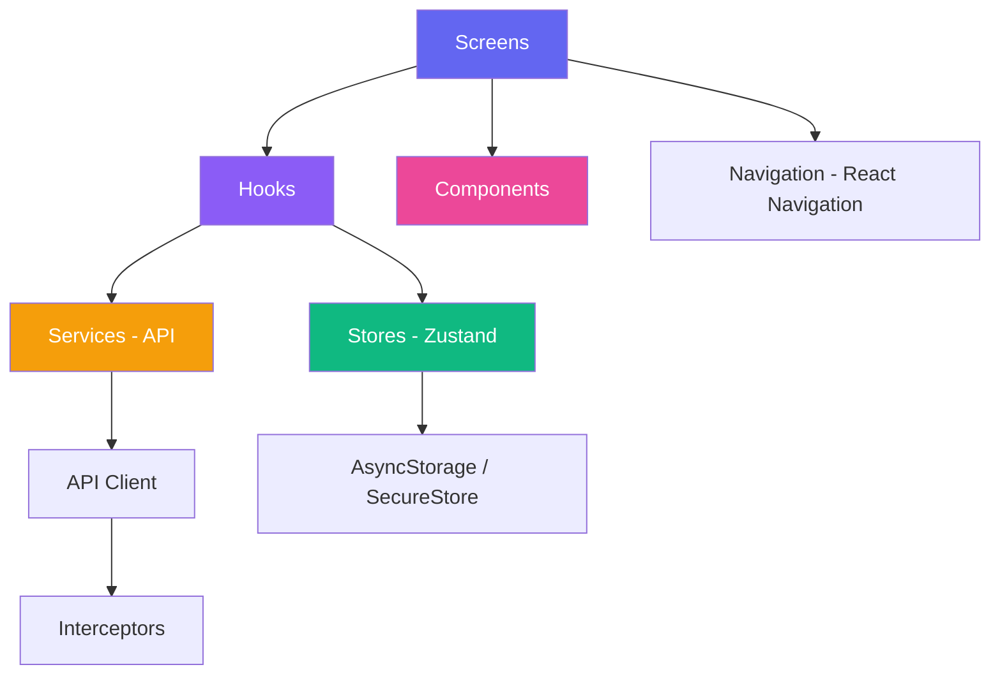

<p align="center">
  
</p>

<h1 align="center">ReactNativeStarter</h1>

<p align="center">
  <strong>Production-ready React Native boilerplate with TypeScript, React Navigation, Zustand & React Query</strong>
</p>

<p align="center">
  <a href="https://github.com/muhittincamdali/ReactNativeStarter/actions/workflows/ci.yml">
    
  </a>
  
  
  
  
</p>

---

## Why This Starter?

Setting up a React Native project with proper architecture, auth flows, navigation, and state management takes days. **ReactNativeStarter** gives you all of that out of the box — with 5 production-quality screens, CI/CD pipelines, and a scalable project structure.

## ✨ Features

| Category | Stack |
|----------|-------|
| 📱 **Framework** | React Native 0.74 + Expo 51 |
| 🧭 **Navigation** | React Navigation v6 (Native Stack + Bottom Tabs) |
| 🔄 **State** | Zustand with persist & devtools middleware |
| 🌐 **Data Fetching** | TanStack React Query (infinite scroll, caching) |
| 🔐 **Auth** | Complete auth flow (login, register, biometrics, social) |
| 📝 **Forms** | Custom validation + Zod schemas |
| 🎨 **Theming** | Light/Dark/System with full design token system |
| 💫 **Animations** | React Native Reanimated v3 |
| 🧪 **Testing** | Jest + React Native Testing Library |
| 📦 **TypeScript** | Strict mode with path aliases |
| 🚀 **CI/CD** | GitHub Actions + EAS Build + Release automation |
| 🔔 **Notifications** | Expo Push Notifications with channels |
| 🔒 **Security** | Expo SecureStore for tokens & credentials |
| ♿ **Accessibility** | Roles, labels, and state across all components |

## 📱 Screens

### 5 fully-built screens included:

| Screen | Description |
|--------|-------------|
| **Login** | Email/password auth, social login (Google, Apple, Facebook), biometric auth, remember me |
| **Home** | Dashboard with animated header, stats cards, quick actions, infinite-scroll feed |
| **Profile** | User profile with parallax header, stats, menu sections, avatar editing |
| **Settings** | Theme, notifications, security, privacy, language — all wired to Zustand |
| **List/Detail** | Searchable list with filters, grid/list toggle, and rich detail view with hero image |

Plus supporting screens: Register, Edit Profile, Forgot Password, Search, Notifications.

## 🚀 Quick Start

```bash
# Clone
git clone https://github.com/muhittincamdali/ReactNativeStarter.git
cd ReactNativeStarter

# Install
npm install

# Start (Expo Go or Dev Client)
npm start

# Platform-specific
npm run ios
npm run android
npm run web
```

## 📁 Project Structure

```
src/
├── app/                        # App entry, providers, root navigator
│   ├── App.tsx                 # Main entry with splash, fonts, providers
│   ├── providers.tsx           # Theme + Toast context providers
│   └── RootNavigator.tsx       # Auth/Main navigation split
├── components/                 # Reusable UI components
│   ├── ui/                     # Button, Input, Card, Avatar, Loading
│   ├── layout/                 # Container, Header, TabBar
│   └── forms/                  # FormField, FormValidation (Zod)
├── screens/                    # Feature screens
│   ├── auth/                   # Login, Register + AuthViewModel
│   ├── home/                   # Home + components (FeedCard, StatsCard, QuickActions)
│   ├── list/                   # ListScreen, DetailScreen + components
│   ├── profile/                # Profile, EditProfile
│   └── settings/               # Settings with all sections
├── hooks/                      # Custom hooks
│   ├── useAuth.ts              # Auth state + token refresh
│   ├── useTheme.ts             # Theme colors/typography/spacing
│   ├── useApi.ts               # Generic API + React Query wrappers
│   ├── useStorage.ts           # AsyncStorage + SecureStore hooks
│   └── useNotifications.ts     # Push notification management
├── services/                   # External services
│   ├── api/                    # ApiClient, AuthService, UserService, interceptors
│   ├── storage/                # AsyncStorage + SecureStorage wrappers
│   └── notifications/          # Push notification setup
├── store/                      # Zustand stores
│   ├── authSlice.ts            # Auth state (user, tokens, session)
│   ├── userSlice.ts            # User profile + stats
│   ├── settingsSlice.ts        # App settings (theme, language, etc.)
│   └── store.ts                # Store factory + reset helpers
├── theme/                      # Design tokens
│   ├── colors.ts               # Light/Dark palettes + Theme type
│   ├── typography.ts           # Font system (display → label)
│   └── spacing.ts              # 4px grid + border radius
├── navigation/                 # Navigation config
│   ├── types.ts                # Type-safe param lists
│   └── linking.ts              # Deep link configuration
├── types/                      # TypeScript definitions
│   ├── models.ts               # Domain models (User, FeedItem, etc.)
│   └── api.ts                  # API types (request, response, error)
└── utils/                      # Utilities
    ├── validators.ts           # Email, password, phone, URL validators
    ├── formatters.ts           # Date, number, text formatters
    └── helpers.ts              # Debounce, throttle, deep clone, etc.
```

## 🏗 Architecture



### Key Patterns

- **MVVM** — Each screen has a ViewModel hook that encapsulates business logic
- **Feature-based** — Code organized by feature, not by technical layer
- **Barrel exports** — Clean imports via index.ts files
- **Type-safe navigation** — Full param list types with global declaration
- **Interceptor chain** — Auth tokens, logging, and error handling in API client

## 🔐 Auth Flow

```
App Launch
  ├─ Check persisted tokens (Zustand + AsyncStorage)
  ├─ Token valid? → Main Navigator (Home, List, Notifications, Profile)
  └─ No token? → Auth Navigator (Login, Register, ForgotPassword)

Login Flow
  ├─ Email/Password → API call → Store tokens → Navigate to Main
  ├─ Social Login (Google/Apple/Facebook) → OAuth → Store tokens
  ├─ Biometric → SecureStore credentials → Refresh token → Main
  └─ Remember Me → Save to SecureStore for biometric next time

Token Management
  ├─ Auto-refresh on app foreground
  ├─ Periodic refresh check (60s interval)
  └─ 401 interceptor → refresh or logout
```

## 🎨 Theming

The theme system provides full design tokens:

```typescript
const { colors, typography, spacing } = useTheme();

// Colors: background, surface, text, primary, error, border, etc.
// Typography: displayLarge → labelSmall (Material Design 3 scale)
// Spacing: 4px grid system (xs=4, sm=8, md=12, lg=16, xl=20...)
```

Supports Light, Dark, and System themes — persisted in Zustand.

## 🧪 Testing

```bash
# Run all tests
npm test

# Watch mode
npm run test:watch

# Coverage report
npm run test:coverage
```

Tests included for:
- **Components** — Button rendering, press handling, variants
- **Hooks** — useAuth state and API integration
- **Utils** — Validators (email, password, name) and formatters
- **Stores** — Can be extended in `__tests__/stores/`

## 🚀 CI/CD

### GitHub Actions Workflows

| Workflow | Trigger | What it does |
|----------|---------|-------------|
| **CI** | Push/PR to main | Lint, type-check, test with coverage |
| **EAS Build** | Tags / manual | Build iOS/Android with Expo EAS |
| **Release** | Version tags | Auto-generate changelog + GitHub Release |

### EAS Build Profiles

```bash
# Development (simulator/emulator)
eas build --profile development

# Preview (internal testing)
eas build --profile preview

# Production (store submission)
eas build --profile production
```

## 📦 Scripts

| Command | Description |
|---------|-------------|
| `npm start` | Start Expo dev server |
| `npm run ios` | Start on iOS simulator |
| `npm run android` | Start on Android emulator |
| `npm run web` | Start web version |
| `npm test` | Run Jest tests |
| `npm run test:coverage` | Tests with coverage report |
| `npm run lint` | ESLint check |
| `npm run lint:fix` | ESLint auto-fix |
| `npm run format` | Prettier format |
| `npm run type-check` | TypeScript validation |
| `npm run build:ios` | EAS Build for iOS |
| `npm run build:android` | EAS Build for Android |

## 🤝 Contributing

See [CONTRIBUTING.md](CONTRIBUTING.md) for guidelines.

1. Fork the repo
2. Create your feature branch (`git checkout -b feature/amazing-feature`)
3. Commit your changes (`git commit -m 'feat: add amazing feature'`)
4. Push to the branch (`git push origin feature/amazing-feature`)
5. Open a Pull Request

## 📄 License

MIT License — see [LICENSE](LICENSE) for details.

---

<p align="center">
  Built with ❤️ by <a href="https://github.com/muhittincamdali">Muhittin Camdali</a>
</p>
