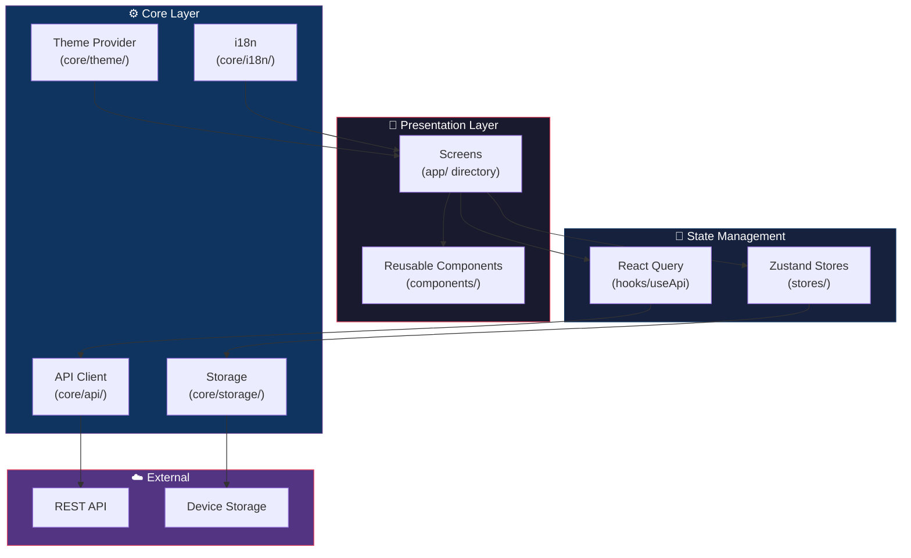
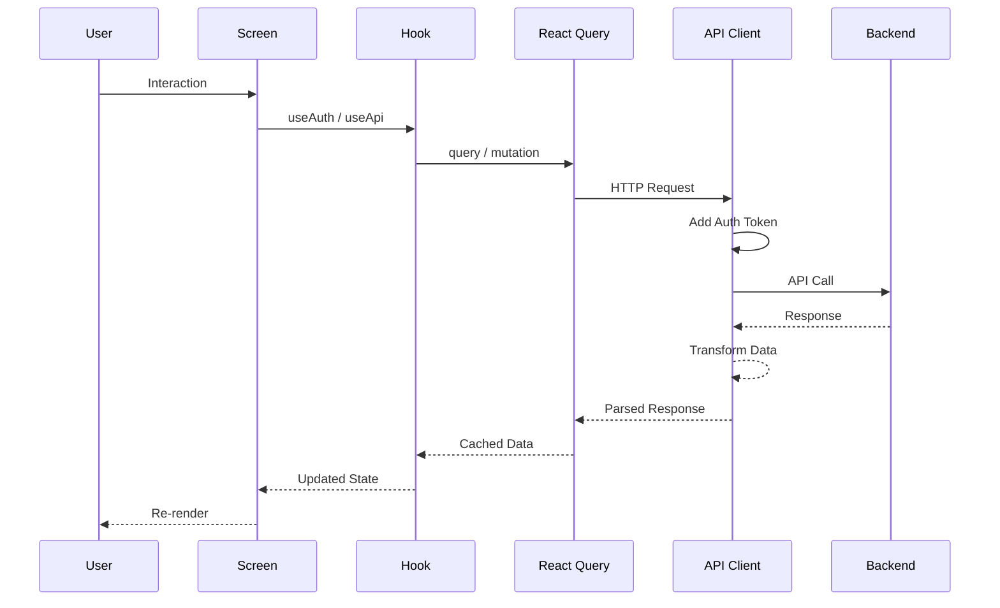

<div align="center">

# ⚡ ReactNativeStarter

### Enterprise-grade React Native boilerplate with Expo Router, Zustand & React Query

[](LICENSE)
[](https://www.typescriptlang.org/)
[](https://expo.dev/)
[](https://reactnative.dev/)
[](https://zustand-demo.pmnd.rs/)
[](https://tanstack.com/query)
[](CONTRIBUTING.md)
[](https://github.com/muhittincamdali/ReactNativeStarter)

**Stop wasting days on project setup. Start building features in minutes.**

[Getting Started](#-getting-started) · [Architecture](#-architecture) · [Features](#-features) · [Documentation](#-documentation)

</div>

---

## 🎯 Why ReactNativeStarter?

Every time you start a new React Native project, you end up spending days configuring the same things — navigation, state management, API layers, theming, storage. This boilerplate eliminates that overhead entirely.

**ReactNativeStarter** gives you a production-ready foundation with battle-tested patterns used in apps serving millions of users.

### What's Inside

| Category | Technology | Why |
|----------|-----------|-----|
| **Framework** | Expo SDK 52 | Managed workflow, OTA updates, EAS Build |
| **Navigation** | Expo Router 4 | File-based routing, typed routes, deep linking |
| **State** | Zustand 5 | Minimal boilerplate, great DX, tiny bundle |
| **Server State** | React Query 5 | Caching, background refetch, optimistic updates |
| **Storage** | MMKV + SecureStore | Blazing fast KV store + encrypted secrets |
| **Styling** | StyleSheet + Theming | Dark/light mode, design tokens, no runtime cost |
| **HTTP** | Axios | Interceptors, retry logic, token refresh |
| **Validation** | Zod | Runtime type validation, form schemas |
| **i18n** | Custom lightweight | English + Turkish out of the box |
| **Animations** | Reanimated 3 | 60fps native animations on UI thread |

---

## ✨ Features

- 🗂️ **File-based routing** with Expo Router — no manual route config
- 🔐 **Authentication flow** — login, register, token management, auto-refresh
- 🌙 **Dark/Light theme** — system-aware with manual override
- 📦 **Zustand stores** — auth + app settings with MMKV persistence
- 🌐 **API client** — Axios with interceptors, retry, error handling
- 🔄 **React Query hooks** — cached data fetching with loading states
- 💾 **MMKV storage** — 30x faster than AsyncStorage
- 🔒 **Secure storage** — encrypted storage for sensitive data
- 🌍 **Internationalization** — EN/TR with easy extension
- 🎨 **Design system** — colors, typography, spacing tokens
- 📱 **Reusable components** — Button, Input, Card, Avatar, LoadingOverlay
- 🛡️ **Error boundary** — graceful error handling with recovery
- ✅ **Form validation** — email, password, phone validators
- 🧪 **Testing setup** — Jest + Testing Library configured
- 📐 **Strict TypeScript** — full type safety across the codebase
- 🔧 **ESLint + Prettier** — consistent code style enforced
- 🚀 **CI/CD ready** — GitHub Actions workflow included
- 📋 **Conventional commits** — standardized commit messages

---

## 🏗️ Architecture



### Data Flow



---

## 📁 Project Structure

```
ReactNativeStarter/
├── src/
│   ├── app/                      # Expo Router pages
│   │   ├── _layout.tsx           # Root layout (providers, fonts)
│   │   ├── (tabs)/               # Tab navigation group
│   │   │   ├── _layout.tsx       # Tab bar configuration
│   │   │   ├── index.tsx         # Home screen
│   │   │   └── profile.tsx       # Profile screen
│   │   └── (auth)/               # Auth flow group
│   │       ├── _layout.tsx       # Auth layout
│   │       ├── login.tsx         # Login screen
│   │       └── register.tsx      # Register screen
│   ├── components/               # Reusable UI components
│   │   ├── Button.tsx            # Configurable button
│   │   ├── Input.tsx             # Text input with validation
│   │   ├── Card.tsx              # Content card
│   │   ├── Avatar.tsx            # User avatar
│   │   ├── LoadingOverlay.tsx    # Full-screen loader
│   │   └── ErrorBoundary.tsx     # Error boundary wrapper
│   ├── core/                     # Core infrastructure
│   │   ├── api/
│   │   │   ├── client.ts         # Axios instance + config
│   │   │   └── interceptors.ts   # Request/response interceptors
│   │   ├── storage/
│   │   │   ├── mmkv.ts           # MMKV wrapper
│   │   │   └── secure-storage.ts # Encrypted storage
│   │   ├── theme/
│   │   │   ├── colors.ts         # Color palette
│   │   │   ├── typography.ts     # Font scales
│   │   │   ├── spacing.ts        # Spacing tokens
│   │   │   └── ThemeProvider.tsx  # Theme context
│   │   └── i18n/
│   │       ├── index.ts          # i18n engine
│   │       ├── en.ts             # English strings
│   │       └── tr.ts             # Turkish strings
│   ├── stores/                   # Zustand stores
│   │   ├── auth.store.ts         # Authentication state
│   │   └── app.store.ts          # App preferences
│   ├── hooks/                    # Custom hooks
│   │   ├── useAuth.ts            # Auth operations
│   │   ├── useApi.ts             # React Query wrappers
│   │   └── useStorage.ts         # Storage helpers
│   ├── utils/                    # Utility functions
│   │   ├── validators.ts         # Input validation
│   │   └── formatters.ts         # Data formatting
│   └── types/                    # TypeScript definitions
│       ├── api.types.ts          # API response types
│       └── navigation.types.ts   # Route params
├── __tests__/                    # Test files
│   ├── stores/
│   │   └── auth.store.test.ts
│   └── utils/
│       └── validators.test.ts
├── assets/                       # Static assets
├── .github/                      # GitHub configuration
│   ├── workflows/ci.yml          # CI pipeline
│   ├── ISSUE_TEMPLATE/           # Issue templates
│   ├── PULL_REQUEST_TEMPLATE.md
│   └── dependabot.yml
├── app.json                      # Expo config
├── babel.config.js               # Babel config
├── metro.config.js               # Metro bundler config
├── tsconfig.json                 # TypeScript config
├── .eslintrc.js                  # ESLint rules
├── .prettierrc                   # Prettier config
├── package.json
├── CONTRIBUTING.md
├── CHANGELOG.md
├── CODE_OF_CONDUCT.md
├── SECURITY.md
└── LICENSE
```

---

## 🚀 Getting Started

### Prerequisites

- **Node.js** 20 or later
- **npm** 10+ or **yarn** 4+
- **Expo CLI**: `npm install -g expo-cli`
- **iOS**: Xcode 15+ (macOS only)
- **Android**: Android Studio with SDK 34+

### Installation

```bash
# Clone the repository
git clone https://github.com/muhittincamdali/ReactNativeStarter.git
cd ReactNativeStarter

# Install dependencies
npm install

# Start the development server
npx expo start
```

### Running on Devices

```bash
# iOS Simulator
npm run ios

# Android Emulator
npm run android

# Web browser
npm run web

# Physical device - scan QR code with Expo Go
npx expo start
```

### Environment Setup

Create a `.env` file in the project root:

```env
# API Configuration
API_BASE_URL=https://api.yourapp.com/v1
API_TIMEOUT=30000

# Feature Flags
ENABLE_BIOMETRIC_AUTH=true
ENABLE_PUSH_NOTIFICATIONS=true
ENABLE_ANALYTICS=false

# Environment
APP_ENV=development
```

---

## 📖 Usage

### Authentication

The auth flow is managed through Zustand store + React Query:

```typescript
import { useAuth } from '@/hooks/useAuth';

function LoginScreen() {
  const { login, isLoading, error } = useAuth();

  const handleLogin = async () => {
    await login({
      email: 'user@example.com',
      password: 'securepassword',
    });
  };

  return (
    <Button
      title="Sign In"
      loading={isLoading}
      onPress={handleLogin}
    />
  );
}
```

### API Calls with React Query

```typescript
import { useUsers, useCreateUser } from '@/hooks/useApi';

function UserList() {
  const { data: users, isLoading, refetch } = useUsers();
  const { mutate: createUser } = useCreateUser();

  return (
    <FlatList
      data={users}
      refreshing={isLoading}
      renderItem={({ item }) => <UserCard user={item} />}
      onRefresh={refetch}
    />
  );
}
```

### Theme Usage

```typescript
import { useTheme } from '@/core/theme/ThemeProvider';

function MyComponent() {
  const { colors, isDark, toggleTheme } = useTheme();

  return (
    <View style={{ backgroundColor: colors.background }}>
      <Text style={{ color: colors.text }}>
        Current theme: {isDark ? 'Dark' : 'Light'}
      </Text>
      <Button title="Toggle" onPress={toggleTheme} />
    </View>
  );
}
```

### Storage

```typescript
import { useStorage } from '@/hooks/useStorage';

function Settings() {
  const { getValue, setValue, removeValue } = useStorage();

  // Fast key-value storage with MMKV
  setValue('onboarding_completed', true);
  const completed = getValue<boolean>('onboarding_completed');

  // Encrypted storage for sensitive data
  await secureStorage.set('auth_token', token);
}
```

### Internationalization

```typescript
import { useI18n } from '@/core/i18n';

function Welcome() {
  const { t, locale, setLocale } = useI18n();

  return (
    <View>
      <Text>{t('welcome.title')}</Text>
      <Button
        title="Türkçe"
        onPress={() => setLocale('tr')}
      />
    </View>
  );
}
```

---

## 🧪 Testing

```bash
# Run all tests
npm test

# Watch mode
npm run test:watch

# Coverage report
npm run test:coverage

# Type checking
npm run type-check
```

### Test Structure

```typescript
// __tests__/stores/auth.store.test.ts
describe('AuthStore', () => {
  it('should login successfully', async () => {
    const { login, isAuthenticated } = useAuthStore.getState();
    await login({ email: 'test@test.com', password: 'password' });
    expect(isAuthenticated).toBe(true);
  });
});
```

---

## 🏗️ Building for Production

### Using EAS Build

```bash
# Configure EAS
npx eas-cli init

# Build for iOS
npm run build:ios

# Build for Android
npm run build:android

# Build both platforms
npm run build:all
```

### OTA Updates

```bash
# Push an over-the-air update
npm run update
```

---

## 🔧 Customization

### Adding a New Screen

1. Create a file in `src/app/`:

```typescript
// src/app/settings.tsx
export default function SettingsScreen() {
  return <View><Text>Settings</Text></View>;
}
```

2. That's it! Expo Router picks it up automatically.

### Adding a New Store

```typescript
// src/stores/settings.store.ts
import { create } from 'zustand';
import { persist, createJSONStorage } from 'zustand/middleware';
import { mmkvStorage } from '@/core/storage/mmkv';

interface SettingsState {
  notifications: boolean;
  toggleNotifications: () => void;
}

export const useSettingsStore = create<SettingsState>()(
  persist(
    (set) => ({
      notifications: true,
      toggleNotifications: () =>
        set((state) => ({ notifications: !state.notifications })),
    }),
    {
      name: 'settings-storage',
      storage: createJSONStorage(() => mmkvStorage),
    },
  ),
);
```

### Adding a New API Endpoint

```typescript
// In hooks/useApi.ts
export function useProducts() {
  return useQuery({
    queryKey: ['products'],
    queryFn: () => apiClient.get<Product[]>('/products'),
    staleTime: 5 * 60 * 1000,
  });
}
```

### Adding a New Language

1. Create `src/core/i18n/de.ts` with translations
2. Register it in `src/core/i18n/index.ts`
3. Done — use `setLocale('de')` to switch

---

## 📊 Performance

| Metric | Value | Notes |
|--------|-------|-------|
| Cold start | ~800ms | Hermes engine + inline requires |
| Storage read | ~0.015ms | MMKV vs ~5ms AsyncStorage |
| Bundle size | ~2.8MB | Tree-shaken, minified |
| JS thread FPS | 60fps | Animations on UI thread |
| TTI | ~1.2s | Time to interactive |

---

## 🤝 Contributing

Contributions are welcome! Please read the [Contributing Guide](CONTRIBUTING.md) before submitting a PR.

1. Fork the repository
2. Create your feature branch (`git checkout -b feature/amazing-feature`)
3. Commit your changes (`git commit -m 'feat: add amazing feature'`)
4. Push to the branch (`git push origin feature/amazing-feature`)
5. Open a Pull Request

---

## 📄 License

This project is licensed under the MIT License — see the [LICENSE](LICENSE) file for details.

---

## 🙏 Acknowledgments

See [ACKNOWLEDGMENTS.md](ACKNOWLEDGMENTS.md) for the full list of libraries and tools that make this project possible.

---

## 📬 Support

Having trouble? Check the [Support Guide](SUPPORT.md) or [open an issue](https://github.com/muhittincamdali/ReactNativeStarter/issues).

---

<div align="center">

**Built with ❤️ by [Muhittin Camdali](https://github.com/muhittincamdali)**

If this project helped you, consider giving it a ⭐

</div>
