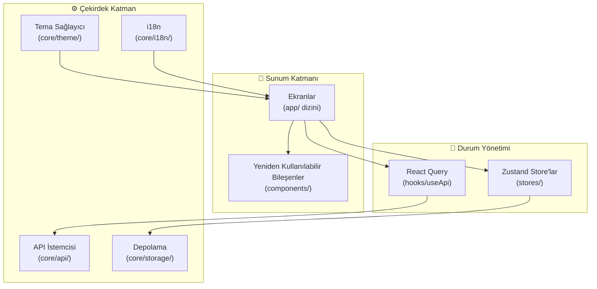

<div align="center">

# ⚡ ReactNativeStarter

### Expo Router, Zustand ve React Query ile kurumsal düzeyde React Native şablonu

[](LICENSE)
[](https://www.typescriptlang.org/)
[](https://expo.dev/)
[](https://reactnative.dev/)

**Proje kurulumuna günler harcamayı bırakın. Dakikalar içinde özellik geliştirmeye başlayın.**

[Başlangıç](#-başlangıç) · [Mimari](#-mimari) · [Özellikler](#-özellikler) · [Dokümantasyon](#-dokümantasyon)

</div>

---

## 🎯 Neden ReactNativeStarter?

Her yeni React Native projesi başlattığınızda, aynı şeyleri yapılandırmak için günler harcarsınız — navigasyon, durum yönetimi, API katmanları, tema, depolama. Bu şablon tüm bu yükü ortadan kaldırır.

**ReactNativeStarter**, milyonlarca kullanıcıya hizmet veren uygulamalarda kullanılan, savaşta test edilmiş kalıplarla üretime hazır bir temel sunar.

### İçerik

| Kategori | Teknoloji | Neden |
|----------|-----------|-------|
| **Framework** | Expo SDK 52 | Yönetilen iş akışı, OTA güncellemeler, EAS Build |
| **Navigasyon** | Expo Router 4 | Dosya tabanlı yönlendirme, tipli rotalar |
| **Durum** | Zustand 5 | Minimal boilerplate, harika DX |
| **Sunucu Durumu** | React Query 5 | Önbellekleme, arka plan yenileme |
| **Depolama** | MMKV + SecureStore | Ultra hızlı KV + şifreli depolama |
| **Tema** | StyleSheet + Tema | Karanlık/aydınlık mod, tasarım token'ları |
| **HTTP** | Axios | Interceptor'lar, yeniden deneme, token yenileme |
| **Doğrulama** | Zod | Çalışma zamanı tip doğrulaması |
| **i18n** | Özel hafif çözüm | İngilizce + Türkçe hazır |
| **Animasyon** | Reanimated 3 | UI thread'de 60fps native animasyonlar |

---

## ✨ Özellikler

- 🗂️ **Dosya tabanlı yönlendirme** — Expo Router ile otomatik rota yapılandırma
- 🔐 **Kimlik doğrulama akışı** — giriş, kayıt, token yönetimi
- 🌙 **Karanlık/Aydınlık tema** — sistem duyarlı, manuel geçiş
- 📦 **Zustand store'ları** — MMKV ile kalıcı depolama
- 🌐 **API istemcisi** — interceptor'lar, yeniden deneme, hata yönetimi
- 🔄 **React Query hook'ları** — önbellekli veri çekme
- 💾 **MMKV depolama** — AsyncStorage'dan 30x hızlı
- 🔒 **Güvenli depolama** — hassas veriler için şifreli depolama
- 🌍 **Çoklu dil** — EN/TR, kolayca genişletilebilir
- 🎨 **Tasarım sistemi** — renk, tipografi, boşluk token'ları
- 📱 **Yeniden kullanılabilir bileşenler** — Button, Input, Card, Avatar
- 🛡️ **Hata sınırı** — kurtarma ile zarif hata yönetimi
- ✅ **Form doğrulama** — e-posta, şifre, telefon doğrulayıcılar
- 🧪 **Test kurulumu** — Jest + Testing Library yapılandırılmış
- 📐 **Katı TypeScript** — tam tip güvenliği
- 🚀 **CI/CD hazır** — GitHub Actions iş akışı dahil

---

## 🚀 Başlangıç

### Gereksinimler

- **Node.js** 20 veya üzeri
- **npm** 10+ veya **yarn** 4+
- **Expo CLI**: `npm install -g expo-cli`
- **iOS**: Xcode 15+ (sadece macOS)
- **Android**: Android Studio, SDK 34+

### Kurulum

```bash
# Repoyu klonla
git clone https://github.com/muhittincamdali/ReactNativeStarter.git
cd ReactNativeStarter

# Bağımlılıkları yükle
npm install

# Geliştirme sunucusunu başlat
npx expo start
```

### Cihazlarda Çalıştırma

```bash
# iOS Simülatörü
npm run ios

# Android Emülatörü
npm run android

# Web tarayıcı
npm run web
```

---

## 🏗️ Mimari



---

## 📁 Proje Yapısı

```
ReactNativeStarter/
├── src/
│   ├── app/                      # Expo Router sayfaları
│   │   ├── _layout.tsx           # Kök layout (provider'lar, fontlar)
│   │   ├── (tabs)/               # Tab navigasyon grubu
│   │   │   ├── _layout.tsx       # Tab bar yapılandırması
│   │   │   ├── index.tsx         # Ana ekran
│   │   │   └── profile.tsx       # Profil ekranı
│   │   └── (auth)/               # Kimlik doğrulama grubu
│   │       ├── _layout.tsx       # Auth layout
│   │       ├── login.tsx         # Giriş ekranı
│   │       └── register.tsx      # Kayıt ekranı
│   ├── components/               # Yeniden kullanılabilir bileşenler
│   ├── core/                     # Çekirdek altyapı
│   ├── stores/                   # Zustand store'ları
│   ├── hooks/                    # Özel hook'lar
│   ├── utils/                    # Yardımcı fonksiyonlar
│   └── types/                    # TypeScript tanımları
├── __tests__/                    # Test dosyaları
├── .github/                      # GitHub yapılandırması
├── app.json                      # Expo yapılandırması
├── tsconfig.json                 # TypeScript yapılandırması
└── package.json
```

---

## 🧪 Test

```bash
# Tüm testleri çalıştır
npm test

# İzleme modu
npm run test:watch

# Kapsam raporu
npm run test:coverage
```

---

## 🤝 Katkıda Bulunma

Katkılar memnuniyetle karşılanır! PR göndermeden önce [Katkıda Bulunma Kılavuzu](CONTRIBUTING.md)'nu okuyun.

---

## 📄 Lisans

Bu proje MIT Lisansı altında lisanslanmıştır — detaylar için [LICENSE](LICENSE) dosyasına bakın.

---

<div align="center">

**❤️ ile yapıldı — [Muhittin Camdali](https://github.com/muhittincamdali)**

</div>
